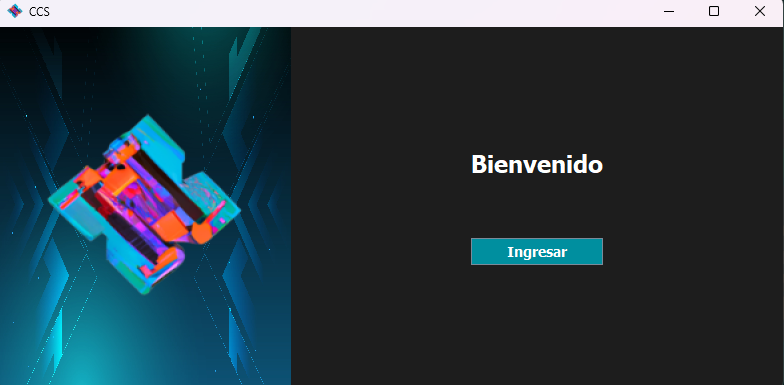
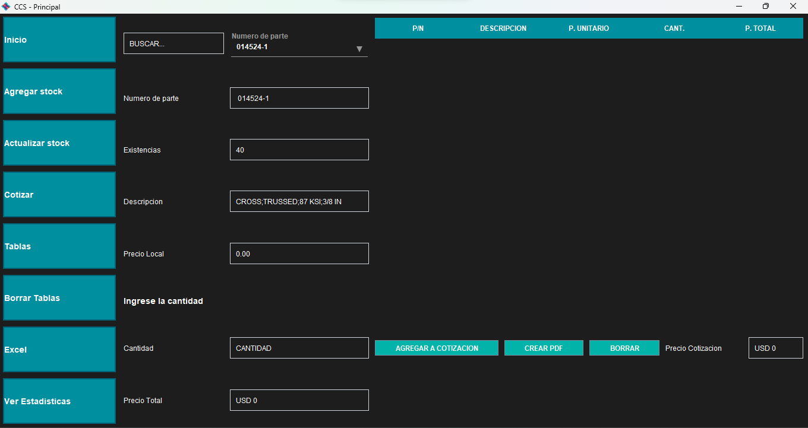
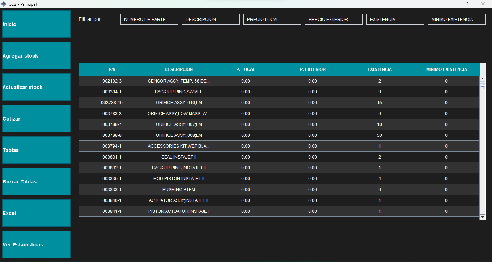

# Stock Management

**Stock Management** is a desktop application built with Java, Python, and SQL designed for managing spare parts stock and quotations. The application provides efficient tools to handle stock control, create quotations, and maintain a history of all transactions.

 <!-- Replace with the path to your image -->

## Features

- **Excel File Upload**: Import stock data, price lists, and minimum value thresholds from Excel files to keep your inventory up-to-date.
- **PDF Generation**: Automatically generatse PDF documents for quotations, allowing for easy sharing and archiving.
- **Local and International Quotations**: Create detailed quotations for both local and international customers.
- **Quotation History**: Maintain a comprehensive history of all quotations for easy reference and auditing.

## Screenshots

### Quotation Example
 <!-- Replace with the path to your image -->

### Table Example
 <!-- Replace with the path to your image -->

